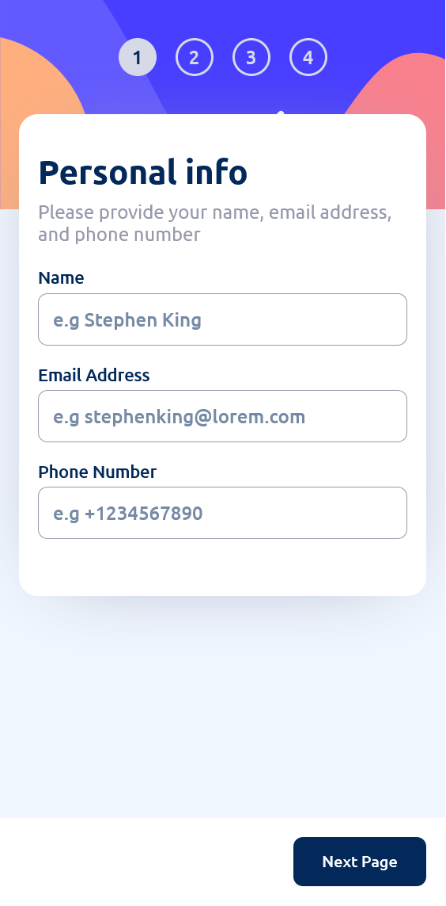
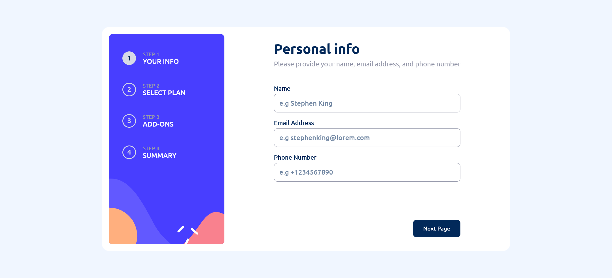

# Frontend Mentor - Multi-step form solution

This is a solution to the [Multi-step form challenge on Frontend Mentor](https://www.frontendmentor.io/challenges/multistep-form-YVAnSdqQBJ). Frontend Mentor challenges help you improve your coding skills by building realistic projects.

## Table of contents

- [Overview](#overview)
  - [The challenge](#the-challenge)
  - [Screenshot](#screenshot)
  - [Links](#links)
- [My process](#my-process)
  - [Built with](#built-with)
  - [What I learned](#what-i-learned)
  - [Continued development](#continued-development)
  - [Useful resources](#useful-resources)
- [Author](#author)

## Overview

### The challenge

Users should be able to:

- Complete each step of the sequence
- Go back to a previous step to update their selections
- See a summary of their selections on the final step and confirm their order
- View the optimal layout for the interface depending on their device's screen size
- See hover and focus states for all interactive elements on the page
- Receive form validation messages if:
  - A field has been missed
  - The email address is not formatted correctly
  - A step is submitted, but no selection has been made

### Screenshot

### Links

- Solution URL: [github repository](https://github.com/quadri101/fem-multi-step-form)
- Live Site URL: [live site here](https://gleeful-croquembouche-7905f8.netlify.app/)

## My process

### Built with

- [React](https://reactjs.org/) - JS library
- [React Router](reactrouter.com) - Routing library used to implement routing
- [Redux-Toolkit](https://redux-toolkit.js.org/) - State Management library
- [Formik](formik.org) - Form management library
- CSS custom properties
- CSS Grid
- Desktop-first workflow

### What I learned

When i started, i had no idea how to implement some features of the application such as routing, state management using [Redux](https://redux.js.org/) and form management, but in the process of building it, I learned how to use Redux-Toolkit, React Router to do these things.

Also, i learned about CSS Grid Template areas. They really made it easy for me to structure the webpage and make it responsive

### Continued development

I plan on diving deeper into the more advanced concepts of React and my next project would probably be something that involves a third-party API, authentication and web sockets

### Useful resources

- [Code Evolution](https://www.youtube.com/@Codevolution) - This is a Youtube channel that i've really learned a lot from. i learned about redux toolkit and the redux pattern on this channel.

- [Kevin Powell](https://www.youtube.com/@KevinPowell) - Another Youtube channel. I learned CSS Grid and Grid template areas on this channel.

## Author

- Frontend Mentor - [@yourusername](https://www.frontendmentor.io/profile/master-shifu0)
- Twitter - [@agbacoder](https://www.twitter.com/quadri_101)
